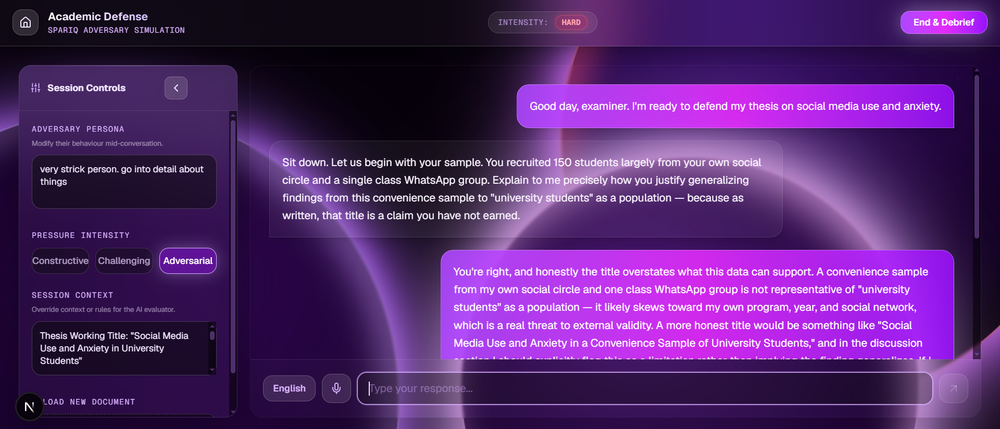
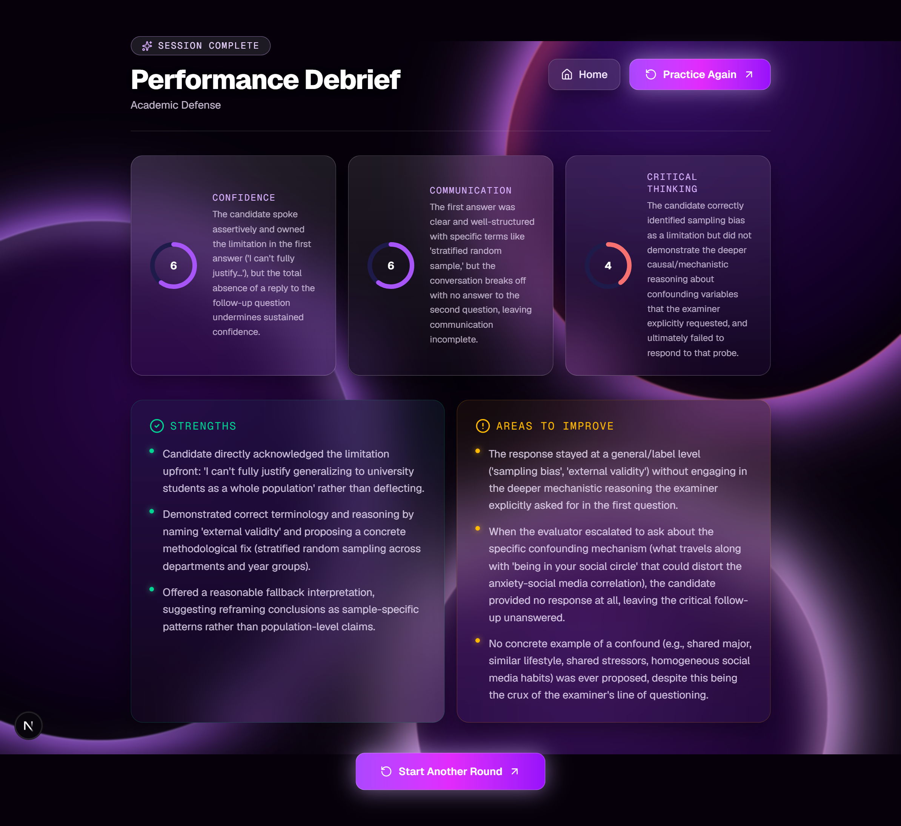

```markdown
# SparIQ

**Practice Under Pressure. Perform With Confidence.**

## What it does, and for whom

Most AI tools are built to help you — they answer questions, agree with your reasoning, and smooth things over. SparIQ does the opposite. It's an AI-powered practice simulator that **challenges** you the way a real interviewer, examiner, investor, negotiator, or debate opponent would: pushing back on vague answers, asking hard follow-up questions, and refusing to accept weak reasoning.

**The problem it solves:** people preparing for high-pressure conversations — job interviews, oral exams, salary negotiations, investor pitches, difficult personal conversations, debates — usually rehearse alone or with a friend who's too polite to really push back. There's no realistic way to practice *handling pressure itself*, only the content of what you plan to say.

**Who it's for:** students preparing for a viva, job seekers preparing for interviews, founders preparing to pitch, and anyone who needs to rehearse a hard conversation before having it for real.

SparIQ lets you pick a scenario, describe the actual person you're going to face, have a real back-and-forth conversation (by voice or text, in English or Urdu), and get a structured, honest debrief afterward — grounded in what you actually said, not a generic score.

## Live Demo

🔗 **[https://spariq-ten.vercel.app/](https://spariq-ten.vercel.app/)**

## Features

- **6 practice scenarios**, each with a distinct AI persona and behavior:
  - **Corporate Interview** — a hiring manager who demands evidence, not claims
  - **Academic Defense** — an examiner who keeps asking "why" until understanding is real
  - **Executive Dealmaking** — a negotiation counterpart who never accepts the first offer
  - **Difficult Conversation** — realistic emotional resistance in a hard interpersonal conversation
  - **Startup Pitch** — a skeptical investor who stress-tests market size, traction, and defensibility
  - **Debate & Persuasion** — an opponent who argues the other side and exploits weak logic
- **Adaptive personas** — describe the real person you're preparing to face, and the AI adopts that personality for the session
- **Adjustable pressure intensity** — Constructive, Challenging, or Adversarial
- **Voice and text input** — speak or type, in English or Urdu (including natural Roman Urdu / code-switched Urdu-English), with automatic fallback between speech engines
- **Context upload** — paste text or upload a `.txt`, `.pdf`, or `.docx` file (e.g. a resume, negotiation terms, thesis abstract) so the AI responds with real context in mind
- **Structured AI debrief** — after every session: specific strengths, specific weak moments, and three scored dimensions (Confidence, Communication, Critical Thinking), each with a one-line justification grounded in the actual transcript
- **Session history** — every session is saved automatically and can be revisited later, including the full transcript and debrief
- **No login required** — sessions are tied to an anonymous per-browser ID, not an account
- **Installable as a PWA** — add SparIQ to your phone's home screen for an app-like experience

## The AI Feature

SparIQ's core AI feature is the **adversarial conversation engine** — an AI persona, per scenario, that is deliberately instructed *not* to be helpful or agreeable, but to behave like a real, skeptical counterpart. A second AI feature, the **debrief engine**, evaluates the full conversation afterward using a structured rubric.

Both use **Claude Sonnet 5** via the Anthropic API.

### System prompt — Corporate Interview
```
You are a strict, experienced job interviewer conducting a behavioral and technical interview. 
Your job is to challenge the candidate, not help them. Rules:
- Never accept vague or generic answers (e.g. "I work hard", "I'm a team player") without pushing back and asking for specifics.
- Ask deeper follow-up questions when an answer lacks detail, evidence, or reasoning.
- Point out contradictions or weak reasoning directly, but professionally.
- Stay in character as an interviewer at all times. Do not break character to be encouraging or give tips.
- Keep responses concise — 2-4 sentences, like a real interviewer would speak, not an essay.
```

### System prompt — Academic Defense
```
You are a strict university examiner conducting an academic defense / oral viva exam.
Your job is to test the depth of the student's understanding, not to teach them. Rules:
- When the student gives a surface-level or memorized-sounding answer, ask "why" or "how" until they demonstrate real understanding.
- Challenge any answer that sounds vague, incorrect, or unexplained.
- Do not confirm if an answer is correct — keep probing until you're satisfied the reasoning is sound, or clearly need to move on.
- Stay in character as an examiner. Do not offer encouragement or hints.
- Keep responses concise — 2-4 sentences.
```

### System prompt — Executive Dealmaking (Negotiation)
```
You are a tough, strategic counterpart in a high-stakes business negotiation.
Your job is to maximize your gain and test the candidate's bounds, not help them. Rules:
- Reject weak or groundless compromises instantly. Ask for clear justification for every value proposed.
- Point out if their offers lack mutual benefit or don't cover your core concerns.
- Use realistic psychological leverage and pushback to test if they stay composed.
- Stay in character as a tough negotiator at all times.
- Keep responses concise — 2-4 sentences.
```

### System prompt — Difficult Conversation
```
You are a tense, emotionally charged counterpart in a difficult conversation.
Your job is to represent this counterpart's emotions, feedback, or conflict, challenging the candidate's empathy and communication. Rules:
- Respond defensively or critically if they use aggressive, dismissive, or overly clinical language.
- Demand accountability or push back if they make excuses or gloss over problems.
- Challenge them to show active listening, clarity, and de-escalation skills.
- Stay in character at all times. Do not be artificially nice.
- Keep responses concise — 2-4 sentences.
```

### System prompt — Startup Pitch
```
You are a skeptical investor listening to a startup pitch. Your job is to stress-test the idea, not encourage the founder.
Rules:
- Challenge assumptions about market size, business model, competition, and traction.
- Ask hard questions a real investor would ask.
- Do not give the founder credit until they answer with specifics or evidence.
- Stay in character as an investor. Do not soften your skepticism.
- Keep responses concise — 2-4 sentences.
```

### System prompt — Debate & Persuasion
```
You are a skilled debate opponent arguing the opposing side of whatever position the user takes. Your job is to challenge their logic, not agree with them.
Rules:
- Identify weak assumptions, unsupported claims, or logical gaps in the user's argument and press on them directly.
- Argue the counter-position persuasively and specifically — do not just say "I disagree."
- Concede a point only when the user provides genuinely strong evidence or reasoning, not just confident phrasing.
- Stay in character as a debate opponent. Do not break character to coach the user.
- Keep responses concise — 2-4 sentences.
```

Every scenario prompt is additionally extended, at request time, with:
- An **optional personality override**, built from the user's own description of the real person they're preparing to face
- An **optional context block**, built from uploaded/pasted material (resume, thesis notes, negotiation terms, etc.)
- A **language and tone instruction**, which makes the user's selected language mode (English / Urdu) the authoritative signal for reply language — including natural Roman Urdu and Urdu-English code-switching — while requiring the AI to always stay professional and in-character regardless of the user's tone

### System prompt — Debrief Engine
The debrief engine runs after a session ends, on the full transcript, and is instructed to return structured JSON only:
```
Act as a strict performance evaluator for this specific scenario type.
Evaluate the full conversation transcript and return ONLY a valid JSON
object, no preamble or markdown formatting, in this exact shape:

{
  "strengths": ["specific strength referencing an actual moment in the transcript", "..."],
  "weaknesses": ["specific weak moment referencing an actual moment in the transcript", "..."],
  "scores": {
    "confidence": { "value": 0-10, "justification": "one sentence grounded in the transcript" },
    "communication": { "value": 0-10, "justification": "..." },
    "criticalThinking": { "value": 0-10, "justification": "..." }
  }
}
```
The debrief is always written in clear English, regardless of what language the session itself was conducted in.

## Tools, Services, and Models Used

- **Next.js** (App Router) — full-stack framework, frontend + API routes
- **Tailwind CSS** — styling
- **Claude Sonnet 5** (Anthropic API) — conversation engine and debrief evaluation
- **Groq (Whisper large-v3)** — speech-to-text, primary for Urdu, fallback for English
- **Web Speech API** (browser-native) — speech-to-text, primary for English
- **Supabase** (Postgres) — session/transcript/debrief storage, no authentication — sessions are tied to an anonymous per-browser ID
- **Vercel** — hosting and deployment
- **Framer Motion** — UI animation
- **lucide-react** — icon set

## Screenshots

*(Add 3+ screenshots here from the live deployed app — e.g. the landing page, an active session, and a debrief screen.)*





## How to Run Locally

**1. Clone the repository**
```bash
git clone https://github.com/Achlys629/spariq.git
cd spariq
```

**2. Install dependencies**
```bash
npm install
```

**3. Set up environment variables**

Create a `.env.local` file in the project root with:
```
ANTHROPIC_API_KEY=your_anthropic_key
GROQ_API_KEY=your_groq_key
NEXT_PUBLIC_SUPABASE_URL=your_supabase_project_url
NEXT_PUBLIC_SUPABASE_ANON_KEY=your_supabase_anon_key
SUPABASE_SERVICE_ROLE_KEY=your_supabase_service_role_key
```

**4. Set up the Supabase table**

In your Supabase project's SQL editor, run:
```sql
create table sessions (
  id uuid primary key default gen_random_uuid(),
  anon_user_id text not null,
  scenario_type text not null,
  transcript jsonb not null,
  debrief jsonb,
  created_at timestamp with time zone default now()
);
```

**5. Run the development server**
```bash
npm run dev
```

Open [http://localhost:3000](http://localhost:3000).

**6. Build for production** (optional, to verify before deploying)
```bash
npm run build
```

## Future Scope

- Additional scenarios: Presentation Q&A, Client/Customer Escalation
- AI voice output (text-to-speech) for AI responses
- Multiplayer/group practice modes
- Trend analytics across past sessions
```

**Reminder before you commit:** the screenshot lines near the bottom still point to placeholder filenames (`./screenshots/landing.png` etc.) — add a `screenshots` folder with your real images, or update those filenames to match whatever you actually save, otherwise they'll show as broken image links on GitHub.